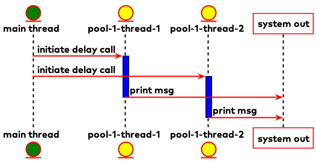

# Kotlin Coroutines Demo

## Contents

* [Introduction](#intro)
* [What this is not](#wtin)
* [Using this project](#utp)
* [Diagrams](#diagrams)
  * [Using a thread pool](#tp)
  * [Use a separate context for delayed](#delayed-coroutine)
  * [Future from coroutine on the main thread](#future-coroutine)
  * [Using the consumer in parallel](#consumer-parallel)

## <a id="intro">Introduction</a>

This is a cli project to get some insight on coroutines. It simulates using a Java API which might have blocking
methods, and what happens when calling those methods from Kotlin. When run using coroutines it might use extension
functions defined
in [Util.kt](https://github.com/gklijs/kotlin-coroutines-demo/blob/main/src/main/kotlin/tech/gklijs/Util.kt) to prevent
blocking the underlying threads. All the action types will provide integers in order, and depending on the run type they
may or may not be printed in order. By setting some parameters such as the delay to get an integer multiple ways of
running the same action can be compared.

## <a id="wtin">What this is not</a>

Since the main focus of this project is to keep things relatively simple, it's lacking some things you would want for
running something in production:

- Using a logging framework, just using println is sufficient for this project.
- Proper error handling, for example when using a callback, it's often possible an error shows up. At which point a
  decision need to be made to either resume with the exception, or do something else like providing a default.
- Being a good example of how coroutines make things simpler. Coroutines help reduce complexity when you have multiple
  async calls that need to be handled in succession. This project just deals with simply getting an Integer and logging
  it and thus doesn't touch that aspect of coroutines. Another nice property of coroutines is that they are easily
  canceled, which is also not handled in this project. If you are interested in this, please take a look
  at [this code](https://github.com/kotlin-hands-on/intro-coroutines.git) belonging
  to [this tutorial](https://play.kotlinlang.org/hands-on/Introduction%20to%20Coroutines%20and%20Channels/01_Introduction)
- Handling streaming/reactive API's. Although certainly interesting case to have a Java Publisher, and how to handle
  that, probably converting it into a flow, it's currently out of scope. Feel free to create a merge request or issue to
  include this, if it has your interest.

## <a id="utp">Using this project</a>

You can run grade with `run --args='-h'` to get the info needed to use the cli thanks
to [kotlinx-cli](https://github.com/Kotlin/kotlinx-cli). For example when
using `gradle run --args='-a future -t 3 -r suspended -d 500'` it will create a future 3 times and wait till all three
of them are realized. Since this is done from a coroutine context, and it doesn't wait for each future to realize before
starting the next one, it will be done running them in only a little more than 500 milliseconds. With coroutines the
actions will be run using launch, so it won't wait for a task to complete before starting the next task.

## <a id="diagrams">Diagrams</a>

Here are some diagrams for some actions to make clear what happens.

### <a id="tp">Using a thread pool</a>

This is one of the ways to run multiple things in parallel. A poll with multiple threads is created and functions can be
executed on of the backing threads. The picture below is an approximation of
running `gradle run --args='-a delayed -t 2 -r thread_pool'`.

### <a id="delayed-coroutine">Use a separate context for delayed</a>

With coroutines, it's possible to switch the coroutine context, thus preventing saturating or blocking one. When the
action `delayed` is run in a coroutine a separate context, `supplierContext` is used of which the backing threads can be
configured with the `-ht` option, by default it's two. The picture below is an approximation of
running `gradle run --args='-a delayed -t 2 -r suspended -ht 2'`

### <a id="future-coroutine">Future from coroutine on the main thread</a>

Using the extension function `eventuallyLog()`
in [Util.kt](https://github.com/gklijs/kotlin-coroutines-demo/blob/main/src/main/kotlin/tech/gklijs/Util.kt) the main
thread just needs to check occasionally if the future is completed already, so isn't blocked like it would with
calling `get()`. The picture below is an approximation of running `gradle run --args='-a future -t 2 -r suspended'`.

### <a id="consumer-parallel">Using the consumer in parallel</a>

Some actions return a consumer. This is a class that was inspired by the Kafka Consumer, but has been drastically
simplified to use as example. A consumer is a class which on the background get 'things', in out case Integers, and from
another thread we can cal poll to get those things. In thus case we will use the action `suspended` that will only be
using the main thread, so it's fine to use the unsafe consumer. In this case `poll(0)` is used to poll, so we don't
block. The picture below is an approximation of running `gradle run --args='-a unsafe_consumer -t 2 -r suspended -ca 2`.

